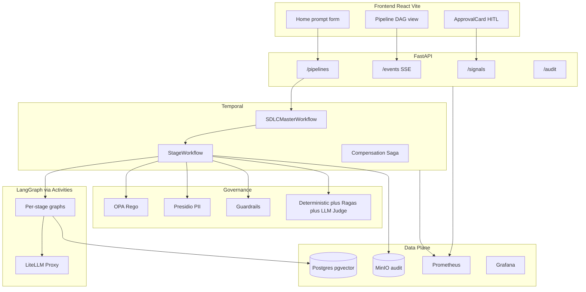

# Agentic SDLC Pipeline — Development Plan

## Requirements mapped to system capabilities

| Assignment requirement | How this system satisfies it |
|---|---|
| Requirement understanding | `classify` → `requirement` / `clarify` agents; structured extraction |
| Task decomposition | Declarative DAG in [`dag/sdlc.yaml`](dag/sdlc.yaml) + stage graphs with plan nodes |
| Brownfield codebase reasoning | `codebase_ingest` + pgvector retrieval before requirement/design |
| Workflow orchestration (critical) | Temporal master + stage child workflows, gates, HITL signals, saga, replan |
| Engineering output | Implementer/tester/documenter write artifacts under `artifacts/{run_id}/` |
| Validation & risk | Deterministic validators → Ragas → LLM-judge; OPA/Presidio/Guardrails |
| Controlled autonomy | HITL on `clarify` + `release_review`; policy `requires_hitl` |
| Final summary | [`docs/FINAL_SUMMARY.md`](docs/FINAL_SUMMARY.md) + three scenario walkthroughs |

**Locked decisions**
- LLM traffic goes through a **LiteLLM proxy** (OpenAI-compatible). Agents use `LITELLM_BASE_URL` + `LITELLM_API_KEY`; model aliases (e.g. `gpt-4o`, `claude-sonnet`) are configured in LiteLLM, not hardcoded provider SDKs.
- **Runtime = local docker-compose only.** Docs map each service to an AWS alternative (no cloud infra implemented).
- **Replay/demo mode** included: run without live LLM by replaying `scenarios/*/replay.json` for demos and CI smoke.

---

## Target architecture

**Control flow per stage (from DAG):** entry gate → agent/activity → exit gate → on fail: retry / compensate / HITL / safe-stop / replan. Never silent skip.

---

## Phase 0 — Foundations (Day 0 half-day)

Fill packaging and shared config so everything else can run.

- [`pyproject.toml`](pyproject.toml): package `services`, deps — `fastapi`, `uvicorn`, `temporalio`, `langgraph`, `langchain`, `langchain-openai` (points at LiteLLM), `httpx`, `pydantic-settings`, `sqlalchemy`, `asyncpg`, `pgvector`, `boto3`, `prometheus-client`, `presidio-*`, `guardrails-ai`, `ruff`, `bandit`, `pytest`, `ragas`, `pyyaml`, `jsonschema`.
- [`.env.example`](.env.example) / extend [`.env`](.env):
  - `LITELLM_BASE_URL=http://litellm:4000` (compose) / `http://localhost:4000` (host)
  - `LITELLM_API_KEY=sk-...`
  - `LITELLM_MODEL_DEFAULT`, `LITELLM_MODEL_JUDGE`, `LITELLM_MODEL_EMBEDDING`
  - `TEMPORAL_HOST`, `DATABASE_URL`, `MINIO_*`, `OPA_URL`, `LANGSMITH_*`
- [`services/common/config.py`](services/common/config.py): pydantic-settings; LLM client factory that sets `base_url=LITELLM_BASE_URL`, `api_key=LITELLM_API_KEY`.
- [`dag/schema.json`](dag/schema.json): JSON Schema for stage fields used in [`dag/sdlc.yaml`](dag/sdlc.yaml).
- [`.gitignore`](.gitignore), [`Makefile`](Makefile) targets: `up`, `down`, `logs`, `test`, `demo-greenfield`, `demo-brownfield`, `demo-ambiguous`, `seed`.
- Fill empty Cursor rules lightly (`10-python-style`, `13-fastapi`, `14-react`, `20-testing`, `40-audit`) so agents stay consistent.

**LiteLLM in compose:** add `litellm` service with a small [`infra/litellm_config.yaml`](infra/litellm_config.yaml) (model list + virtual key). Upstream provider keys live only in LiteLLM env, not in agent code. Document that reviewers can point `LITELLM_BASE_URL` at an existing corporate LiteLLM instead of the bundled container.

---

## Phase 1 — Audit, policy, judge (Day 0–1)

Build governance before agents so gates are real from day one.

### Audit
- [`services/audit/event_schema.py`](services/audit/event_schema.py): canonical events (`ActivityStarted/Succeeded/Failed`, `GateResult`, `PolicyCheck`, `HITLDecision`, `Replan`, `Compensation`, `MetricSample`).
- [`writer.py`](services/audit/writer.py) + [`circuit_breaker.py`](services/audit/circuit_breaker.py): MinIO primary, local FS fallback under `./data/audit/`.
- [`replay.py`](services/audit/replay.py): rebuild timeline for UI + demo mode.

### Policy engine
- Rego: [`policies/security.rego`](policies/security.rego), `change_control.rego`, `code_standards.rego`, `pii.rego` + `*_test.rego`.
- [`policy_gate.py`](services/policy_engine/policy_gate.py): **single** entry — Presidio → OPA → Guardrails; return `PolicyDecision`.
- OPA sidecar loads `policies/` as a bundle.

### Judge (layered)
- [`deterministic.py`](services/judge/deterministic.py): `ast.parse`, ruff, bandit, pytest runner, coverage floor.
- [`ragas_eval.py`](services/judge/ragas_eval.py): faithfulness/relevancy on RAG answers (brownfield).
- [`llm_judge.py`](services/judge/llm_judge.py): subjective quality via LiteLLM; **never overrides** deterministic fail.
- [`scoring.py`](services/judge/scoring.py): composite → gate pass/fail + threshold from config.

---

## Phase 2 — Orchestration core (Day 1)

### DAG loader
- [`dag_loader.py`](services/orchestrator/dag_loader.py): load/validate YAML against schema; expose adjacency, gates, HITL flags, retry/compensation metadata, `on_result` branches (`ambiguous`/`greenfield`/`brownfield`).

### Temporal
- [`sdlc_master.py`](services/orchestrator/workflows/sdlc_master.py): interpret DAG at runtime; spawn stage children; join parallel branches (`implementation_plan` ∥ `test_plan` after design); maintain compensation stack; handle signals `approve` / `reject` / `replan` / `safe_stop`.
- [`stage_workflow.py`](services/orchestrator/workflows/stage_workflow.py): entry gates → agent/activity → exit gates → bounded retry → escalate.
- [`compensation.py`](services/orchestrator/workflows/compensation.py): reverse-order saga (e.g. `revert_files` for implementation).
- Activities on queues per rules: `agent-activities`, `policy-activities`, `audit-activities`; workflows on `sdlc-workflows`.
- [`worker.py`](services/orchestrator/worker.py): register workflows + activities.

**Determinism boundary:** workflows never call LiteLLM/IO; only activities do.

---

## Phase 3 — Agents + knowledge (Day 1–2)

### Shared agent infra
- [`state.py`](services/agents/state.py): serializable Pydantic state (`trace_id`, `run_id`, `stage_id`, artifacts refs).
- [`prompt_loader.py`](services/agents/prompt_loader.py): LangSmith Hub primary, [`prompts/*.md`](prompts/) fallback.
- Tools under `services/agents/tools/`: `file_reader`, `code_writer` (policy-gated), `test_runner`, `artifact_store`.
- Nodes: `retrieve` → `plan` → `execute` → `self_review` → `output_validate`; replan loop cap **3**.

### Graphs (one job each per personas rule)
| Graph | Output |
|---|---|
| `classifier_graph` | `greenfield \| brownfield \| ambiguous` + questions |
| `requirement_graph` | normalized requirements + acceptance criteria |
| `design_graph` | components, schema, API contract |
| `implementation_graph` | code under `artifacts/{run_id}/url_shortener/` |
| `test_graph` | tests + pytest report |
| `doc_graph` | README / API docs |
| Clarifier | HITL Q&A → refined requirement → replan from `requirement` |

All LLM calls: `ChatOpenAI(base_url=..., api_key=..., model=alias)` → LiteLLM.

### Knowledge (brownfield)
- Seed URL shortener in [`scenarios/brownfield/seed_repo/`](scenarios/brownfield/seed_repo/) (minimal FastAPI shortener).
- [`ingest.py`](services/knowledge/ingest.py) / embeddings via LiteLLM embedding model → pgvector.
- Retrieval activity feeds design/implementer context.

---

## Phase 4 — FastAPI + React frontend (Day 2)

### API
- `POST /pipelines` — body `{ prompt, scenario_type?, mode: live|replay }` → start `SDLCMasterWorkflow`.
- `GET /pipelines/{id}` — status, current stage, artifact summary.
- `POST /signals/{id}` — approve/reject/replan/safe_stop → Temporal signal.
- `GET /events/{id}` — SSE of audit events.
- `GET /audit/{id}`, `GET /metrics`, `GET /health`.

### Frontend (Vite + React + Tailwind)
- **Home**: large prompt textarea + scenario chips (Greenfield / Brownfield / Ambiguous) + Start → creates pipeline.
- **Pipeline**: live [`DagView`](frontend/src/components/DagView.tsx) (stage states), [`EventStream`](frontend/src/components/EventStream.tsx), artifact links.
- **ApprovalCard**: clarify + release HITL; posts signals.
- **Audit / Metrics / Scenarios** pages as scaffolded.
- Hooks: `usePipeline`, `useSSE`, `useApproval`; API client to FastAPI.

No auth for prototype (document as intentional limitation).

---

## Phase 5 — Local deployment (Day 2)

[`infra/docker-compose.yml`](infra/docker-compose.yml) services:

| Service | Role |
|---|---|
| `postgres` | state + pgvector |
| `temporal` + UI | orchestration |
| `minio` | audit object store |
| `opa` | policy |
| `litellm` | LLM proxy |
| `api` | FastAPI |
| `worker` | Temporal worker |
| `frontend` | nginx/vite build |
| `prometheus` + `grafana` | reliability metrics |

Dockerfiles: [`Dockerfile.api`](infra/Dockerfile.api), [`Dockerfile.worker`](infra/Dockerfile.worker), [`Dockerfile.frontend`](infra/Dockerfile.frontend).

Init: Postgres schema, MinIO bucket, Grafana dashboard [`agentic-sdlc.json`](infra/grafana/dashboards/agentic-sdlc.json) (success rate, retries, rollbacks, MTTR, e2e latency).

**Operator path:** `cp .env.example .env` → set LiteLLM upstream keys → `make up` → open UI → run scenario.

---

## Phase 6 — Scenarios, tests, docs (Day 2–3)

### Scenarios
- **Greenfield:** build URL shortener (APIs, analytics, reliability) from prompt.
- **Brownfield:** seed repo + “add rate limiting + Redis cache”; show ingest + impact analysis.
- **Ambiguous:** “enterprise-ready” → clarifier HITL → replan.

Each has `requirement`/`change_request`, `expected_artifacts`, and greenfield `replay.json` for offline demo.

### Tests
- Unit: dag_loader, policy_gate, scoring, event schema.
- Integration: Temporal `WorkflowEnvironment` with mocked activities; OPA Rego tests.
- E2E: compose smoke + one live greenfield (if LiteLLM configured) + replay path always green in CI.

### Docs (deliverables)
Fill [`docs/ARCHITECTURE.md`](docs/ARCHITECTURE.md), `ORCHESTRATION`, `GOVERNANCE`, `OBSERVABILITY`, `TESTING`, `SETUP`, `SCENARIOS`, `LIMITATIONS`, `FINAL_SUMMARY`, ADRs 0001–0003, root [`README.md`](README.md).

### AWS alternatives (docs only — local remains the implementation)

| Local (compose) | AWS alternative |
|---|---|
| Temporal + worker | Amazon Managed Workflows for Apache Airflow **or** Step Functions + ECS tasks *(note ADR: Temporal Cloud on AWS is also valid; Step Functions ≠ full Temporal feature parity)* |
| FastAPI `api` / `worker` | ECS Fargate (or EKS) behind ALB |
| React frontend | S3 + CloudFront (static) or Amplify |
| Postgres + pgvector | RDS PostgreSQL + `pgvector`, or OpenSearch for retrieval |
| MinIO | S3 |
| OPA sidecar | OPA on ECS/EKS, or verified permissions via AWS Verified Permissions where applicable |
| LiteLLM proxy | LiteLLM on ECS/Fargate (or Bedrock via LiteLLM providers) |
| Prometheus + Grafana | Amazon Managed Prometheus + Managed Grafana (or CloudWatch) |
| LangSmith | LangSmith Cloud (external) or self-host on ECS |
| Secrets in `.env` | Secrets Manager / SSM Parameter Store |
| Local disk artifacts | EFS or S3 versioned artifact bucket |

Document **why local-first** (2–3 day prototype, reproducible demo) and what would change for production (authN/Z, multi-tenant isolation, stronger sandboxing for generated code).

---

## Implementation order (execution sequence)

1. Config + pyproject + LiteLLM compose + Makefile  
2. Audit schema/writer + policy Rego + policy_gate + deterministic judge  
3. dag_loader + Temporal master/stage/compensation + worker  
4. Agent graphs + prompts + tools + knowledge ingest  
5. FastAPI routers + SSE  
6. React UI (Home prompt → Pipeline → HITL)  
7. Scenarios + seed repo + replay mode  
8. Grafana dashboard + metrics wiring  
9. Docs/ADRs including AWS mapping + README setup  
10. Unit/integration/e2e + `make demo-*` scripts  

---

## Success criteria (reviewable demo)

1. `make up` brings stack healthy; UI loads.  
2. User pastes a greenfield prompt → DAG runs with visible stage transitions and audit stream.  
3. Ambiguous prompt pauses on HITL; approve after clarification continues.  
4. Brownfield run retrieves from seed repo and proposes targeted changes.  
5. Gate failure triggers bounded retry then HITL or safe-stop (no silent skip).  
6. Grafana shows at least success/retry/latency panels.  
7. Replay mode completes without LiteLLM.  
8. Docs explain architecture, three scenarios, limitations, and AWS service alternatives.
